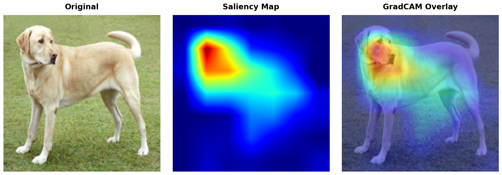

# Getting Started with torchxai

torchxai is a PyTorch explainability library with a one-line API: `explain(model, image)`. It works with CNNs (ResNet, VGG, EfficientNet) and Vision Transformers (ViT, DeiT, Swin), and accepts images in virtually any format.

---

## Table of Contents

1. [Installation](#installation)
2. [Your First Explanation in 60 Seconds](#your-first-explanation-in-60-seconds)
3. [All Input Types](#all-input-types)
4. [Choosing a Method](#choosing-a-method)
5. [Using Individual Explainers](#using-individual-explainers)
6. [Saving and Exporting](#saving-and-exporting)
7. [Next Steps](#next-steps)

---

## Installation

### From PyPI (recommended)

```bash
pip install torchxai-explain
```

> **Note:** The PyPI package is `torchxai-explain`, not `torchxai`. Installing `torchxai` will give you a different, unrelated package.

### From Source

```bash
git clone https://github.com/torchxai/torchxai.git
cd torchxai
pip install -e .
```

### Verify Your Installation

```bash
python -c "import torchxai; print('OK')"
```

Expected output:

```
OK
```

### Requirements

- Python 3.8 or later
- PyTorch 1.10 or later
- torchvision

If you have a GPU, torchxai will use it automatically when your model is on a CUDA device. No extra steps required.

---

## Your First Explanation in 60 Seconds

The following complete example loads a pretrained ResNet-50, runs it on an image, and produces a visual explanation of which pixels drove the prediction.

```python
import torch
import torchvision.models as models
from torchxai import explain, show_explanation

# 1. Load a pretrained model and put it in eval mode
model = models.resnet50(weights="IMAGENET1K_V1")
model.eval()

# 2. Point to your image — a file path string works out of the box
image = "path/to/your/image.jpg"

# 3. Generate the explanation with a single call
explanation = explain(model, image)

# 4. Visualize it
show_explanation(explanation)
```

That's it. `explain()` handles preprocessing, forward/backward passes, and heatmap generation automatically.

The output looks like this — a heatmap overlaid on the original image, highlighting the regions the model found most important:



Warmer colors (red/yellow) indicate regions with high importance; cooler colors (blue) indicate low importance.

---

## All Input Types

torchxai accepts images in five formats. Use whichever is most natural for your workflow.

### 1. File Path String

The simplest option when you have an image on disk.

```python
from torchxai import explain

explanation = explain(model, "path/to/image.jpg")
```

### 2. `pathlib.Path`

Works identically to a string path. Useful when your paths are already `Path` objects.

```python
from pathlib import Path
from torchxai import explain

image_path = Path("path/to/image.jpg")
explanation = explain(model, image_path)
```

### 3. PIL Image

Use this when you have already loaded or processed an image with Pillow.

```python
from PIL import Image
from torchxai import explain

pil_image = Image.open("path/to/image.jpg").convert("RGB")
explanation = explain(model, pil_image)
```

### 4. NumPy Array

Use this when your image comes from OpenCV, scikit-image, or any other NumPy-based pipeline.

```python
import numpy as np
from torchxai import explain

# Shape: (H, W, C), dtype: uint8 or float32
numpy_image = np.array(Image.open("path/to/image.jpg"))
explanation = explain(model, numpy_image)
```

### 5. PyTorch Tensor

Use this when you are already working in PyTorch — for example, pulling a batch from a DataLoader.

```python
import torch
from torchxai import explain

# 4D batch tensor: (1, C, H, W)
batch_tensor = torch.randn(1, 3, 224, 224)
explanation = explain(model, batch_tensor)

# 3D single-image tensor: (C, H, W) — also accepted
single_tensor = torch.randn(3, 224, 224)
explanation = explain(model, single_tensor)
```

> **Tip:** When passing tensors, torchxai assumes your values are already preprocessed (normalized to ImageNet statistics). If you pass a raw tensor with pixel values in [0, 255], the model may produce poor predictions. See [Common Mistakes](troubleshooting.md#common-mistakes) for details.

---

## Choosing a Method

torchxai supports six explanation methods. The default (used when you call `explain(model, image)`) is GradCAM.

### Method Comparison

| Method | Works With | Speed | Heatmap Quality | Requires Gradients | Best For |
|---|---|---|---|---|---|
| `gradcam` | CNNs | Fast | High | Yes | General CNN explanations |
| `eigencam` | CNNs | Very fast | Medium | No | Large batches, fast iteration |
| `layercam` | CNNs | Fast | High (fine-grained) | Yes | Detailed spatial explanations |
| `gradcam++` | CNNs | Fast | High | Yes | Multiple objects in scene |
| `attention_rollout` | ViTs | Fast | High | No | Vision Transformers |
| `transformer_attribution` | ViTs | Medium | Very high | Yes | High-quality ViT explanations |

### Specifying a Method

Pass the `method` argument to `explain()`:

```python
from torchxai import explain

# Use GradCAM (default)
explanation = explain(model, image, method="gradcam")

# Use EigenCAM for faster results
explanation = explain(model, image, method="eigencam")

# Use AttentionRollout for a Vision Transformer
explanation = explain(vit_model, image, method="attention_rollout")
```

### Quick Recommendations

- **Unsure where to start?** Use `gradcam`. It works well on virtually all CNN architectures with no tuning.
- **Working with a Vision Transformer (ViT, DeiT, Swin)?** Use `attention_rollout`. It is fast and leverages the model's native attention mechanism.
- **Need the highest quality ViT explanation?** Use `transformer_attribution`. It takes a little longer but produces sharper, more faithful heatmaps.
- **Need the fastest possible results** (large batches, real-time pipelines)? Use `eigencam`. It requires no gradient computation.
- **Detecting multiple objects?** Use `gradcam++`. It handles multi-instance scenes better than standard GradCAM.
- **Need fine-grained spatial detail?** Use `layercam`. It produces higher-resolution activations than GradCAM.

---

## Using Individual Explainers

In addition to the `explain()` shortcut, you can instantiate explainer classes directly. This is useful when you want to reuse the same explainer across many images without re-initializing it each time.

### GradCAM

```python
import torchvision.models as models
from torchxai import GradCAM, show_explanation

model = models.resnet50(weights="IMAGENET1K_V1")
model.eval()

# Instantiate once
explainer = GradCAM(model)

# Reuse for many images
explanation1 = explainer.explain("image1.jpg")
explanation2 = explainer.explain("image2.jpg")

show_explanation(explanation1)
```

### EigenCAM

```python
from torchxai import EigenCAM

explainer = EigenCAM(model)
explanation = explainer.explain("image.jpg")
```

### LayerCAM

```python
from torchxai import LayerCAM

explainer = LayerCAM(model)
explanation = explainer.explain("image.jpg")
```

### GradCAM++

```python
from torchxai import GradCAMPlusPlus

explainer = GradCAMPlusPlus(model)
explanation = explainer.explain("image.jpg")
```

### AttentionRollout (Vision Transformers)

```python
import torchvision.models as models
from torchxai import AttentionRollout, show_explanation

# Load a Vision Transformer
vit_model = models.vit_b_16(weights="IMAGENET1K_V1")
vit_model.eval()

explainer = AttentionRollout(vit_model)
explanation = explainer.explain("image.jpg")

show_explanation(explanation)
```

### TransformerAttribution (Vision Transformers)

```python
from torchxai import TransformerAttribution

explainer = TransformerAttribution(vit_model)
explanation = explainer.explain("image.jpg")
```

### Targeting a Specific Layer

By default, torchxai targets the last convolutional (or attention) layer. You can override this:

```python
from torchxai import GradCAM

# Specify any named layer in your model
explainer = GradCAM(model, target_layer="layer3")
explanation = explainer.explain("image.jpg")
```

To find the valid layer names for your model:

```python
for name, module in model.named_modules():
    print(name)
```

---

## Saving and Exporting

### Display in a Window or Notebook

`show_explanation()` renders the heatmap overlaid on the original image. In a Jupyter notebook it displays inline; in a script it opens a window.

```python
from torchxai import explain, show_explanation

explanation = explain(model, "image.jpg")
show_explanation(explanation)
```

### Save a Heatmap to Disk

`save_heatmap()` writes the raw heatmap (without overlay) to a file.

```python
from torchxai import explain, save_heatmap

explanation = explain(model, "image.jpg")
save_heatmap(explanation, save_path="outputs/heatmap.png")
```

### Overlay a Heatmap on the Original Image

`overlay_heatmap()` returns a blended image with the heatmap superimposed on the original. You can then save or display it.

```python
from torchxai import explain, overlay_heatmap
from PIL import Image

explanation = explain(model, "image.jpg")

# Returns a PIL Image with the overlay applied
overlaid = overlay_heatmap(explanation, alpha=0.5)
overlaid.save("outputs/overlaid.png")
```

The `alpha` parameter controls opacity: `0.0` shows only the original image, `1.0` shows only the heatmap.

### Create a Side-by-Side Comparison

`create_comparison()` produces a single image with the original and the explanation side by side — useful for reports and presentations.

```python
from torchxai import explain, create_comparison

explanation = explain(model, "image.jpg")

# Saves a side-by-side PNG and also returns it as a PIL Image
comparison = create_comparison(explanation, save_path="outputs/comparison.png")
```


### Complete Export Workflow

```python
import torchvision.models as models
from torchxai import explain, show_explanation, save_heatmap, overlay_heatmap, create_comparison

model = models.resnet50(weights="IMAGENET1K_V1")
model.eval()

explanation = explain(model, "image.jpg")

# Display interactively
show_explanation(explanation)

# Save raw heatmap
save_heatmap(explanation, save_path="outputs/heatmap.png")

# Save overlaid image
overlaid = overlay_heatmap(explanation, alpha=0.5)
overlaid.save("outputs/overlaid.png")

# Save side-by-side comparison
create_comparison(explanation, save_path="outputs/comparison.png")
```

---

## Next Steps

- **[API Reference](api-reference.md)** — full documentation for every function and class, including all parameters and return types.
- **[Methods](methods.md)** — deep-dive into how each explanation method works, with mathematical background and guidance on when to use each.
- **[Advanced Usage](advanced.md)** — custom preprocessing, batched explanations, integrating with training loops, and more.
- **[Troubleshooting](troubleshooting.md)** — solutions to common errors and frequently asked questions.
