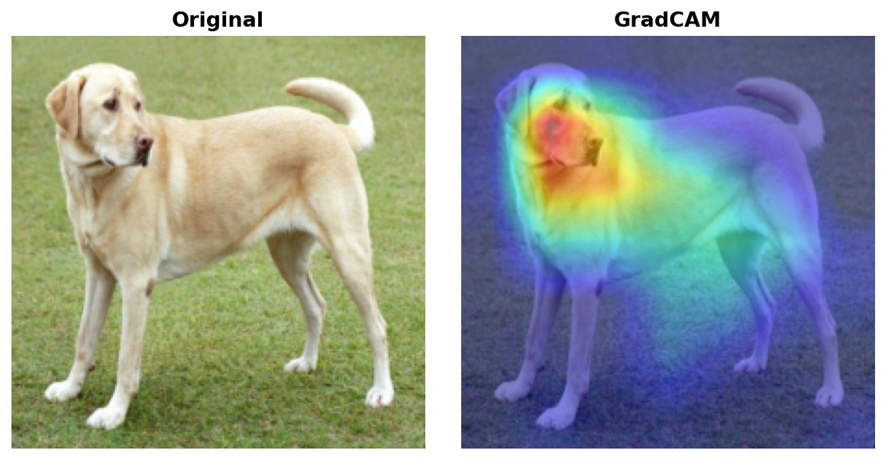
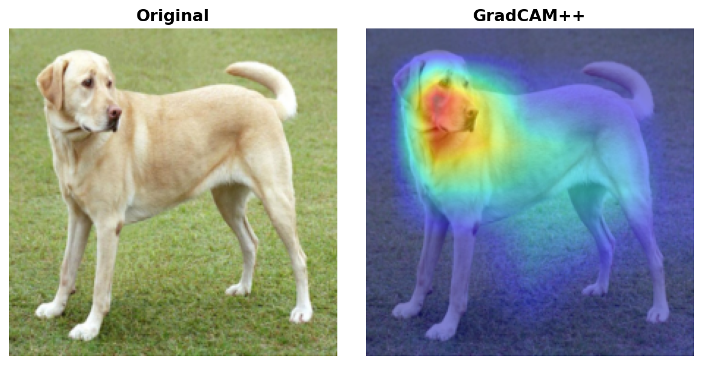
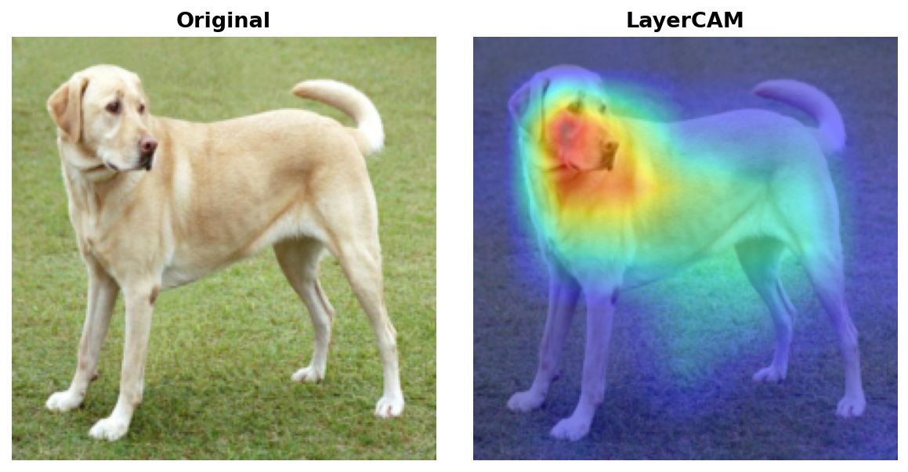
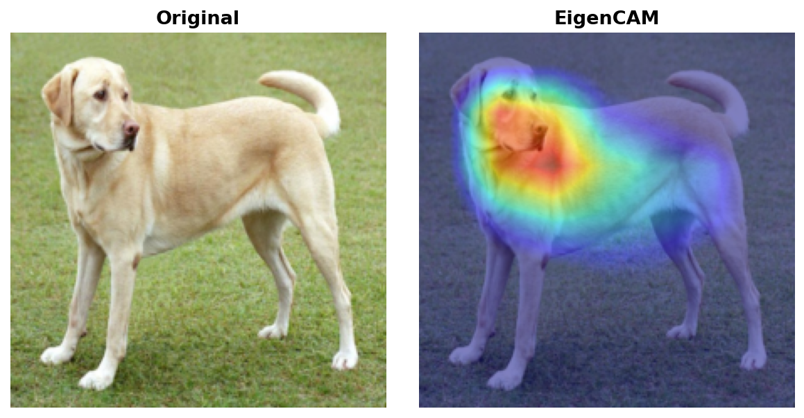
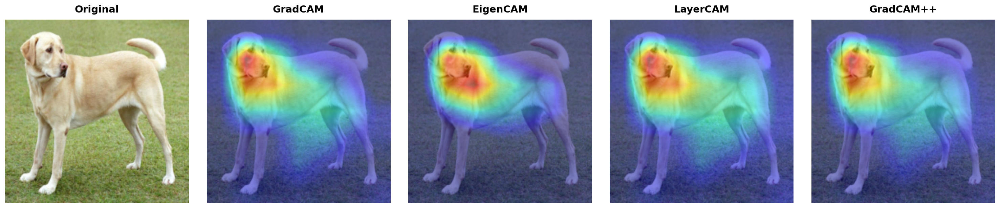

# Explainability Methods Guide

torchxai implements six explainability methods spanning CNN-based gradient attribution, activation-based analysis, and transformer attention propagation. This guide covers how each method works, when to reach for it, and its limitations.

---

## Table of Contents

1. [GradCAM](#gradcam)
2. [GradCAM++](#gradcam-1)
3. [LayerCAM](#layercam)
4. [EigenCAM](#eigencam)
5. [Attention Rollout](#attention-rollout)
6. [Transformer Attribution](#transformer-attribution)
7. [Method Comparison Table](#method-comparison-table)
8. [Decision Flowchart](#decision-flowchart)

---

## GradCAM

**Paper:** Selvaraju et al., "Grad-CAM: Visual Explanations from Deep Networks via Gradient-based Localization", ICCV 2017

### Intuition

GradCAM answers: *which spatial regions of the feature maps most influence the prediction?* It combines **WHERE** the model activates (the feature maps themselves) with **HOW IMPORTANT** those activations are (the gradients of the class score flowing back through those maps). The result is a coarse heatmap localized to the regions that drove the prediction.

### How It Works

1. **Forward pass** — run the image through the model and record the activations at the chosen convolutional layer (typically the last one before the classifier head).
2. **Backward pass** — compute the gradient of the target class score \( y^c \) with respect to each spatial location \( (i, j) \) in each feature map channel \( k \): \( \frac{\partial y^c}{\partial A^k_{ij}} \).
3. **Global average pooling over gradients** — collapse the spatial gradient map for each channel into a single scalar weight \( \alpha^c_k = \frac{1}{Z} \sum_i \sum_j \frac{\partial y^c}{\partial A^k_{ij}} \). This weight captures the global importance of channel \( k \) for class \( c \).
4. **Weighted combination of feature maps** — form the raw CAM by computing the sum \( \sum_k \alpha^c_k A^k \), where each feature map is scaled by its importance weight.
5. **ReLU** — apply ReLU to retain only the regions with a *positive* influence on the target class, discarding features that suppress it.
6. **Upsample to input size** — bilinearly resize the resulting low-resolution heatmap to match the original image dimensions for overlay.

```python
from torchxai import explain
import torchvision.models as models
from PIL import Image

model = models.resnet50(pretrained=True).eval()
image = Image.open("cat.jpg")

result = explain(model, image, method="gradcam")
result.show()
```

### When to Use

- **General-purpose default.** If you are unsure which method to pick, start here.
- Works with any CNN architecture (ResNet, VGG, EfficientNet, ConvNeXt, etc.).
- Good for understanding broad regions of interest (object-level localization).
- Reliable when there is a single dominant object of the target class in the scene.

### Limitations

- **Coarse spatial resolution** — the heatmap is bounded by the spatial dimensions of the chosen feature map. For ResNet-50, the last conv layer produces 7×7 activations, so fine-grained pixel detail is lost after upsampling.
- **Single-object bias** — when multiple instances of the target class appear, GradCAM tends to highlight whichever instance dominates the feature map, potentially missing the others.
- Requires a backward pass, so it cannot be used with non-differentiable components in the computation path.

### Example Output



*GradCAM overlay on a sample image. The heatmap is coarse but correctly localizes the dominant region of interest.*

---

## GradCAM++

**Paper:** Chattopadhyay et al., "Grad-CAM++: Improved Visual Explanations for Deep Convolutional Networks", WACV 2018

### Intuition

GradCAM++ improves on GradCAM by computing more **precise per-pixel weights** using second-order gradient information. The core insight is that the simple global average pooling used in GradCAM treats all spatial positions equally when computing channel importance. GradCAM++ instead weights each position in the gradient map differently based on how much that specific location contributes to the overall gradient — this makes it substantially better at handling **multiple instances of the same class** within a single scene.

### How It Works

1. **Forward pass** — identical to GradCAM; record feature map activations \( A^k \) at the target layer.
2. **Backward pass** — compute first-, second-, and third-order gradients of the target class score with respect to each feature map activation.
3. **Pixel-wise importance weights** — use the higher-order gradients to compute a per-pixel weighting \( \alpha^{kc}_{ij} \) for each channel. This replaces the simple spatial average used in GradCAM. The weights are designed so that pixels near the object boundaries are up-weighted relative to background.
4. **Weighted combination** — apply the spatially-varying weights to the feature maps: \( \text{CAM}^c = \text{ReLU}\!\left(\sum_k \alpha^{kc}_{ij} \cdot A^k_{ij}\right) \).
5. **ReLU** — retain only positive contributions.
6. **Upsample to input size** — bilinear resize to match the original image.

```python
result = explain(model, image, method="gradcam++")
result.show()
```

### When to Use

- Scenes containing **multiple instances of the target class** (e.g., a group of birds, a crowd of people).
- When GradCAM produces a blob that misses part of the scene.
- Fine-grained classification tasks where precise localization matters more than broad region identification.

### Limitations

- Marginally slower than GradCAM due to higher-order gradient computation.
- The improvement over GradCAM is most pronounced for multi-instance scenes; for single-object images the results are typically similar.

### Example Output



*GradCAM++ better captures both instances when multiple objects of the same class are present.*

---

## LayerCAM

**Paper:** Jiang et al., "LayerCAM: Exploring Hierarchical Class Activation Maps for Localization", IEEE Transactions on Image Processing 2021

### Intuition

LayerCAM applies gradient weighting **pixel-by-pixel** within each feature map rather than collapsing gradients to a per-channel scalar (as GradCAM does). This preserves far more spatial detail. Think of it as GradCAM operating at full spatial resolution within the feature map, making it capable of capturing fine-grained structure such as object parts, textures, or small discriminative regions.

### How It Works

1. **Forward pass** — record feature map activations \( A^k \) at the chosen layer.
2. **Backward pass** — compute gradients \( \frac{\partial y^c}{\partial A^k_{ij}} \) at each spatial position \( (i, j) \) for each channel \( k \).
3. **Element-wise weighting** — multiply the gradients directly with the activations at every spatial position: \( W^k_{ij} = \text{ReLU}\!\left(\frac{\partial y^c}{\partial A^k_{ij}}\right) \cdot A^k_{ij} \). No pooling — the spatial structure is kept intact.
4. **Aggregate across channels** — sum the per-channel weighted maps to produce a single spatial saliency map.
5. **Upsample to input size** — bilinear resize; because the feature maps preserve more detail at earlier layers, LayerCAM is particularly effective when applied to shallower layers.

```python
result = explain(model, image, method="layercam")
result.show()
```

### When to Use

- **Fine-grained localization** — identifying specific parts of an object (e.g., the eyes of a face, the wheels of a car) rather than the whole object.
- Debugging model focus at multiple scales by applying LayerCAM to different layers.
- Tasks where GradCAM produces overly coarse results that don't align with the object boundary.

### Limitations

- More sensitive to layer choice than GradCAM. Using the wrong layer can produce noisy or uninformative results.
- Higher-resolution feature maps (from early layers) can produce noisy outputs that require post-processing.

### Example Output



*LayerCAM produces finer spatial detail, better tracking the object outline compared to GradCAM.*

---

## EigenCAM

**Paper:** Muhammad & Yeasin, "EigenCAM: Class Activation Map using Principal Components", IJCNN 2020

### Intuition

EigenCAM takes a fundamentally different approach: it **does not require gradients at all**. Instead, it applies PCA (via singular value decomposition) to the raw feature map activations and uses the **first principal component** as the saliency map. This captures the dominant mode of variation in what the model "sees" at that layer — the structures and patterns that account for the most activation energy. Because there is no backward pass, EigenCAM cannot answer "why class X?" but it can rapidly and efficiently answer "what is the model looking at?".

### How It Works

1. **Forward pass only** — run the image through the network and record the feature map activations \( A \in \mathbb{R}^{C \times H \times W} \) at the target layer.
2. **Reshape** — flatten the spatial dimensions to get a matrix of shape \( C \times (H \cdot W) \).
3. **Singular Value Decomposition (SVD)** — decompose the activation matrix: \( A = U \Sigma V^T \). The first right singular vector \( v_1 \) (corresponding to the largest singular value) captures the principal axis of activation.
4. **Reshape back** — project the activations onto \( v_1 \) and reshape the result to \( H \times W \). This is the raw saliency map.
5. **Normalize and upsample** — min-max normalize to [0, 1] and bilinearly resize to input dimensions.

```python
result = explain(model, image, method="eigencam")
result.show()
```

### When to Use

- When **speed is critical** — EigenCAM requires only a single forward pass, making it the fastest available method, especially for high-throughput inference pipelines.
- **Class-agnostic visualization** — when you want to understand what the model attends to in general, rather than for a specific class.
- Batch processing large datasets where running backward passes would be prohibitively expensive.
- Exploratory analysis and debugging when you want a quick sanity check on model focus.

### Limitations

- **Not class-specific** — EigenCAM cannot distinguish between "why is this a cat?" and "why is this a dog?". For the same image, it produces the same heatmap regardless of the target class.
- The principal component may capture texture or background structure rather than the discriminative object if the model has not learned strong localized representations.

### Example Output



*EigenCAM highlights the dominant activation structure. Note the result is identical regardless of target class.*

---

## Attention Rollout

**Paper:** Abnar & Zuidema, "Quantifying Attention Flow in Transformers", ACL 2020

### Intuition

Vision Transformers (ViT, DeiT, Swin) process images as sequences of patches and use self-attention to relate patches to each other. A single attention matrix from a single layer is not sufficient to understand where the model is looking — attention propagates and mixes across layers. Attention Rollout addresses this by **tracing information flow through all attention layers simultaneously**, asking: "at the final layer, which input patches contributed most to the [CLS] token decision?".

### How It Works

1. **Capture attention matrices** — run a forward pass and record the self-attention matrices \( A^{(l)} \in \mathbb{R}^{h \times N \times N} \) from every transformer layer \( l \), where \( h \) is the number of attention heads and \( N \) is the sequence length (number of patches + 1 for the CLS token).
2. **Average over heads** — average each layer's attention matrix across all heads: \( \bar{A}^{(l)} \in \mathbb{R}^{N \times N} \).
3. **Add residual connections** — each transformer block has a residual connection, which means identity information also flows through. Model this by adding the identity matrix: \( \hat{A}^{(l)} = 0.5 \cdot \bar{A}^{(l)} + 0.5 \cdot I \).
4. **Normalize rows** — ensure each row sums to 1 (re-normalize after adding identity).
5. **Multiply through all layers** — compute the rollout matrix as the product of all layer attention matrices from input to output: \( R = \hat{A}^{(L)} \cdot \hat{A}^{(L-1)} \cdots \hat{A}^{(1)} \).
6. **Extract CLS-to-patch attention** — take the row corresponding to the CLS token, which gives the amount of attention each input patch received from the output. Reshape to the patch grid and upsample.

```python
import timm

model = timm.create_model("vit_base_patch16_224", pretrained=True).eval()
result = explain(model, image, method="attention_rollout")
result.show()
```

### When to Use

- Your model is a **Vision Transformer** (ViT, DeiT, BEiT, Swin Transformer, etc.).
- You want a computationally lightweight attention-based explanation (no backward pass needed beyond what is required to get attention weights).
- You need an overview of "where is the model paying attention?" across the full depth of the network.

### Limitations

- **Class-agnostic** — like EigenCAM, Attention Rollout cannot distinguish between classes. The same heatmap is produced regardless of the target class.
- The residual connection weighting (the 0.5 factor) is a heuristic; different values can significantly change the resulting map.
- May spread attention diffusely across many patches rather than producing sharp localization.
- Not applicable to CNNs.

---

## Transformer Attribution

**Paper:** Chefer et al., "Transformer Interpretability Beyond Attention Visualization", CVPR 2021

### Intuition

Transformer Attribution combines the spatial locality of attention maps with the discriminative specificity of gradients. It asks: not just "where does attention flow?" but "which attended patches actually mattered for predicting this specific class?". This produces **class-specific explanations for Vision Transformers**, filling the gap left by Attention Rollout.

### How It Works

1. **Forward pass with attention recording** — run the image and record all attention matrices \( A^{(l)} \) from every layer, as in Attention Rollout.
2. **Backward pass** — compute the gradient of the target class score \( y^c \) with respect to each attention matrix \( A^{(l)} \). These gradients indicate which attention connections matter most for the prediction.
3. **Gradient-weighted attention** — for each layer, multiply the attention matrix element-wise with its gradient: \( \tilde{A}^{(l)} = A^{(l)} \odot \frac{\partial y^c}{\partial A^{(l)}} \). Apply ReLU to keep only positive contributions.
4. **Average over heads** — average the weighted attention across all heads in each layer.
5. **Rollout with weighted matrices** — propagate the gradient-weighted attention matrices through all layers using the same rollout procedure as Attention Rollout (multiply matrices, accounting for residual connections).
6. **Extract and upsample** — take the CLS-to-patch row, reshape, and upsample to input size.

```python
model = timm.create_model("vit_base_patch16_224", pretrained=True).eval()
result = explain(model, image, method="transformer_attribution", target_class=243)
result.show()
```

### When to Use

- **Class-specific explanation for Vision Transformers** — when you need to answer "why does the model predict class X?" rather than "what is the model attending to?".
- Comparing model focus across different predicted classes on the same image.
- Research or auditing scenarios requiring the highest-quality ViT explanations.

### Limitations

- Slower than Attention Rollout — requires both forward and backward passes.
- Only applicable to transformer architectures with extractable attention matrices. Standard `torch.nn.MultiheadAttention` modules require hooks to capture attention weights.
- Like all gradient methods, the explanation can be sensitive to input perturbations.

---

## Method Comparison Table

| Method | Speed | Class-Specific | Works on CNNs | Works on ViTs | Spatial Detail | Paper |
|---|---|---|---|---|---|---|
| GradCAM | Fast | Yes | Yes | No | Low (feature map resolution) | Selvaraju et al., ICCV 2017 |
| GradCAM++ | Fast | Yes | Yes | No | Low–Medium | Chattopadhyay et al., WACV 2018 |
| LayerCAM | Fast | Yes | Yes | No | Medium–High | Jiang et al., TIP 2021 |
| EigenCAM | Fastest | No | Yes | Partial* | Medium | Muhammad & Yeasin, IJCNN 2020 |
| Attention Rollout | Fast | No | No | Yes | Medium | Abnar & Zuidema, ACL 2020 |
| Transformer Attribution | Moderate | Yes | No | Yes | Medium | Chefer et al., CVPR 2021 |

\* EigenCAM can be applied to convolutional feature maps in hybrid ViT architectures.

**Speed definitions:**
- **Fastest** — forward pass only, no gradient computation
- **Fast** — one forward + one backward pass
- **Moderate** — multiple passes or higher-order gradient computation

### Visual Comparison



*Side-by-side comparison of all methods on the same input image. Note the difference in spatial granularity between GradCAM (coarse), LayerCAM (fine), and EigenCAM (class-agnostic).*

---

## Decision Flowchart

Use this flowchart to select the right method for your use case.

```
Is your model a CNN or a Vision Transformer?
│
├── CNN
│   │
│   ├── Do you need the explanation to be class-specific?
│   │   │
│   │   ├── YES
│   │   │   │
│   │   │   ├── Do you need fine-grained / part-level localization?
│   │   │   │   ├── YES  → LayerCAM
│   │   │   │   └── NO
│   │   │   │       │
│   │   │   │       └── Are there multiple instances of the target class in the scene?
│   │   │   │           ├── YES  → GradCAM++
│   │   │   │           └── NO   → GradCAM  ← general-purpose default
│   │   │
│   │   └── NO (class-agnostic is fine)
│   │       └── Is raw speed the primary concern?
│   │           ├── YES  → EigenCAM  ← fastest, no backward pass
│   │           └── NO   → GradCAM (still fast and interpretable)
│
└── Vision Transformer (ViT, DeiT, Swin, BEiT, ...)
    │
    ├── Do you need the explanation to be class-specific?
    │   ├── YES  → Transformer Attribution
    │   └── NO   → Attention Rollout  ← faster, no backward pass
    │
    └── Unsure / exploratory?
        └── Start with Attention Rollout, then use Transformer Attribution
            to verify class-specific attribution
```

### Quick-Reference Summary

| Situation | Recommended Method |
|---|---|
| First time, don't know what to pick | GradCAM |
| Multiple objects of same class | GradCAM++ |
| Need to see object parts / fine detail | LayerCAM |
| Need speed above all else | EigenCAM |
| Using a Vision Transformer | Attention Rollout (fast) or Transformer Attribution (class-specific) |
| Batch processing large datasets | EigenCAM or Attention Rollout |
| Research / highest quality ViT explanation | Transformer Attribution |
