# Model Compatibility — 20 Model Families + 4 Detectors, All Verified

Every result on this page was generated with real pretrained models by
[`generate_proof_images.py`](https://github.com/rigvedrs/torchxai/blob/main/generate_proof_images.py). Each heatmap is
also **scored automatically** against a foreground/background split of the
test photo — a combination is only marked ✅ if its heatmap actually lands on
the subject. Numbers below are CPU timings from the latest verification run;
the raw scores live in [`verification_results.json`](assets/proof/verification_results.json).

> All proof images live in [`docs/assets/proof/`](assets/proof/). Nothing is
> mocked or simulated — every heatmap was produced on the same Labrador
> Retriever photo ([`original_dog.jpg`](assets/proof/original_dog.jpg)).

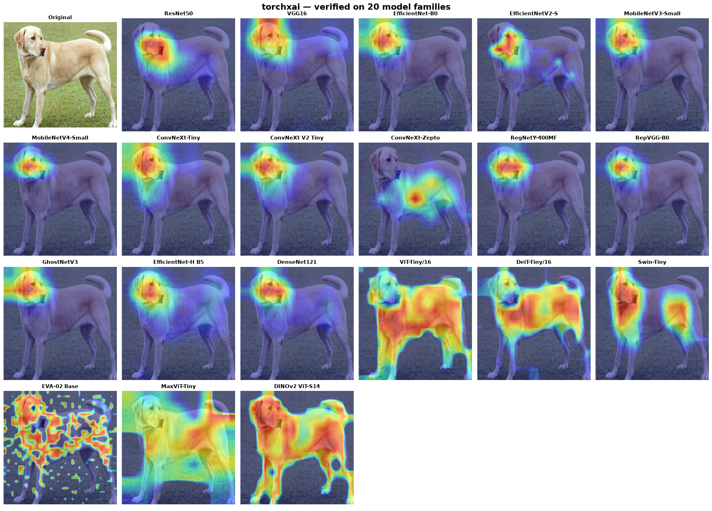

**Legend:** ✅ verified (heatmap focuses on the subject) · ⚠️ known limitation
(see notes) · — not applicable

---

## Section 1: CNN Classifiers

### 1. ResNet50 (torchvision)

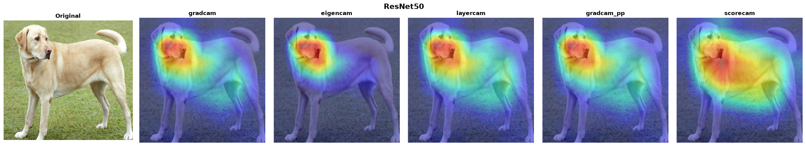

| Method | Status | Time |
|--------|--------|------|
| GradCAM | ✅ | 81ms |
| EigenCAM | ✅ | 171ms |
| LayerCAM | ✅ | 61ms |
| GradCAM++ | ✅ | 58ms |
| ScoreCAM | ✅ | 2,274ms |

```python
from torchxai import explain
import torchvision.models as models

model = models.resnet50(pretrained=True)
heatmap = explain(model, "dog.jpg")  # Just works
```

---

### 2. VGG16 (torchvision)

torchxai hooks the ReLU after the last convolution (post-activation,
14×14) so every method — including activation-based ScoreCAM — sees
non-negative feature maps at full resolution.

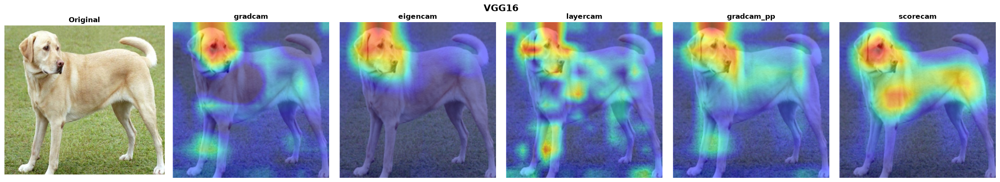

| Method | Status | Time |
|--------|--------|------|
| GradCAM | ✅ | 420ms |
| EigenCAM | ✅ | 278ms |
| LayerCAM | ✅ | 176ms |
| GradCAM++ | ✅ | 157ms |
| ScoreCAM | ✅ | 2,113ms |

```python
model = models.vgg16(pretrained=True)
heatmap = explain(model, "dog.jpg")
```

---

### 3. EfficientNet-B0 (torchvision) & EfficientNetV2-S (timm)

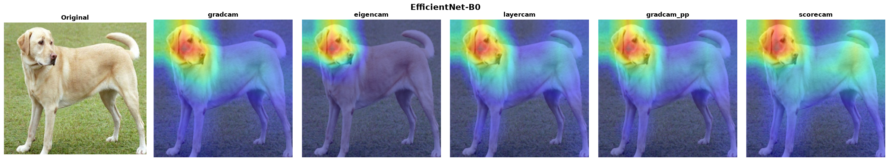
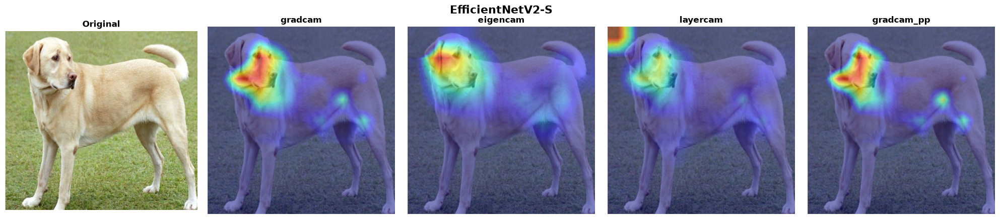

| Method | B0 | V2-S |
|--------|----|------|
| GradCAM | ✅ 616ms | ✅ 2,525ms |
| EigenCAM | ✅ 873ms | ✅ 456ms |
| LayerCAM | ✅ 614ms | ✅ 3,773ms |
| GradCAM++ | ✅ 613ms | ✅ 4,094ms |
| ScoreCAM | ✅ 7,139ms | — |

```python
model = models.efficientnet_b0(pretrained=True)
heatmap = explain(model, "dog.jpg")

# timm variant
import timm
model = timm.create_model("efficientnetv2_rw_s.ra2_in1k", pretrained=True)
heatmap = explain(model, "dog.jpg")
```

---

### 4. MobileNetV3-Small (torchvision) & MobileNetV4-Small (timm)

For timm's MobileNet family, `conv_head` runs **after** global pooling —
hooking it yields a useless 1×1 map. torchxai automatically targets the
last spatial block instead.

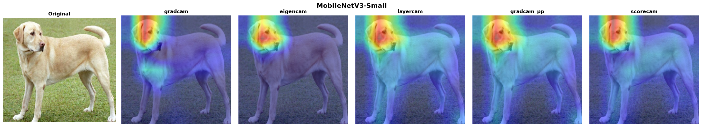
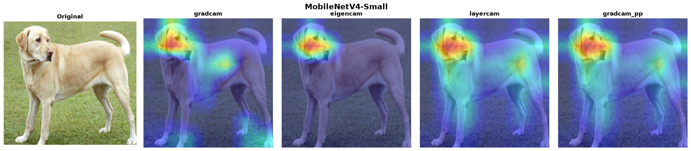

| Method | V3-Small | V4-Small |
|--------|----------|----------|
| GradCAM | ✅ 421ms | ✅ 563ms |
| EigenCAM | ✅ 315ms | ✅ 101ms |
| LayerCAM | ✅ 177ms | ✅ 298ms |
| GradCAM++ | ✅ 178ms | ✅ 296ms |
| ScoreCAM | ✅ 2,408ms | — |

```python
model = models.mobilenet_v3_small(pretrained=True)
heatmap = explain(model, "dog.jpg")

model = timm.create_model("mobilenetv4_conv_small.e2400_r224_in1k", pretrained=True)
heatmap = explain(model, "dog.jpg")
```

---

### 5. ConvNeXt family — Tiny (torchvision), V2 Tiny (timm), Zepto (timm)

ConvNeXt places LayerNorm between the feature maps and the classifier, so
gradient-weighted CAMs have an ambiguous sign. torchxai resolves the
polarity with an insertion/deletion confidence test, so the heatmaps stay
on the subject.

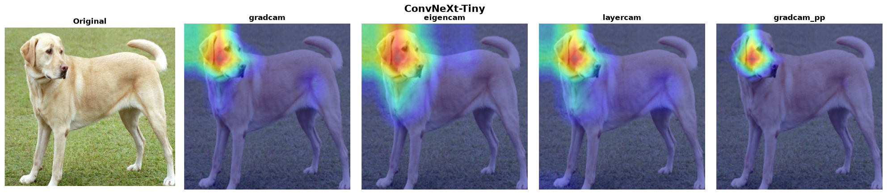
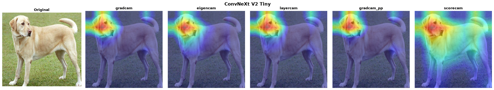
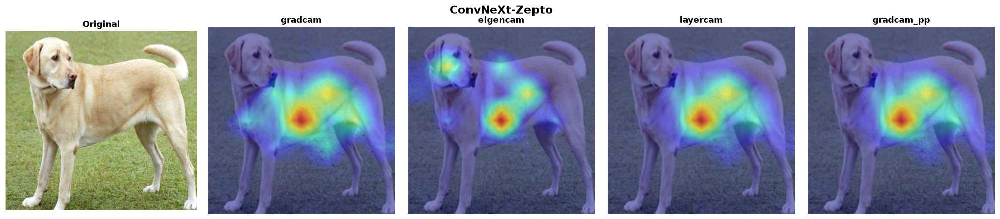

| Method | Tiny | V2 Tiny | Zepto |
|--------|------|---------|-------|
| GradCAM | ✅ 2,153ms | ✅ 2,132ms | ✅ 308ms |
| EigenCAM | ✅ 1,437ms | ✅ 1,367ms | ✅ 236ms |
| LayerCAM | ✅ 2,127ms | ✅ 2,207ms | ✅ 288ms |
| GradCAM++ | ✅ 2,121ms | ✅ 2,110ms | ✅ 293ms |
| ScoreCAM | — | ✅ 10,676ms | — |

```python
model = models.convnext_tiny(pretrained=True)
heatmap = explain(model, "dog.jpg")

model = timm.create_model("convnextv2_tiny.fcmae_ft_in22k_in1k", pretrained=True)
heatmap = explain(model, "dog.jpg")
```

---

### 6. RegNetY-400MF (torchvision) & RepVGG-B0 (timm)

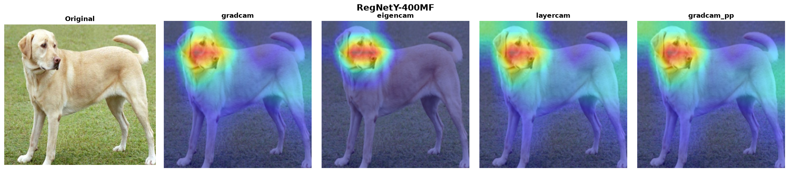
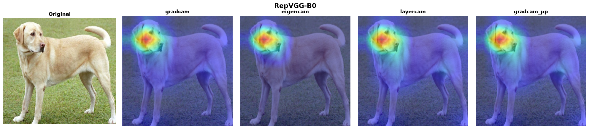

| Method | RegNetY | RepVGG |
|--------|---------|--------|
| GradCAM | ✅ 175ms | ✅ 65ms |
| EigenCAM | ✅ 133ms | ✅ 44ms |
| LayerCAM | ✅ 93ms | ✅ 71ms |
| GradCAM++ | ✅ 96ms | ✅ 70ms |

---

### 7. GhostNetV3 & EfficientNet-H B5 (timm)

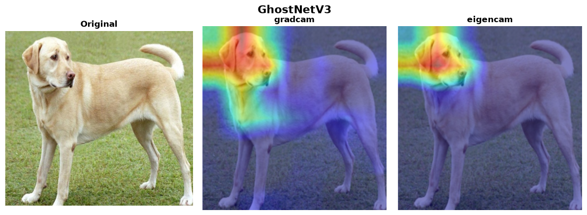
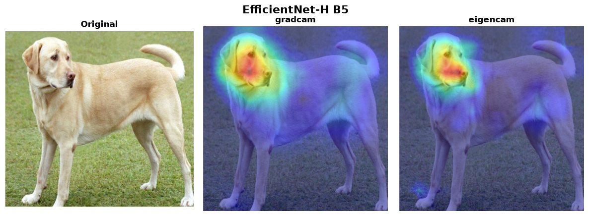

| Method | GhostNetV3 | EfficientNet-H B5 |
|--------|------------|-------------------|
| GradCAM | ✅ 4,091ms | ✅ 7,043ms |
| EigenCAM | ✅ 2,627ms | ✅ 6,450ms |

EfficientNet-H B5 runs at its native 448×448 input — torchxai reads the
expected input size from the model, no manual configuration needed.

---

### 8. DenseNet121 (torchvision)

Gradient-based methods hit a known PyTorch backward-hook conflict with
DenseNet's in-place operations. Use the gradient-free methods.

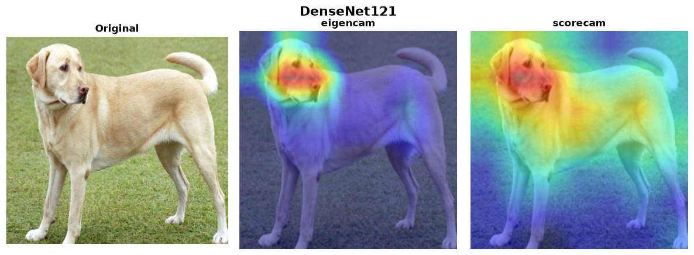

| Method | Status | Time | Notes |
|--------|--------|------|-------|
| GradCAM | ⚠️ | — | PyTorch backward hook + view tensor conflict |
| EigenCAM | ✅ | 235ms | Recommended for DenseNet |
| LayerCAM | ⚠️ | — | Same as GradCAM |
| GradCAM++ | ⚠️ | — | Same as GradCAM |
| ScoreCAM | ✅ | 2,047ms | Gradient-free; works correctly |

```python
model = models.densenet121(pretrained=True)
heatmap = explain(model, "dog.jpg", method="eigencam")
```

---

## Section 2: Vision Transformers

torchxai captures real attention matrices from timm models (it temporarily
disables fused scaled-dot-product attention during the hooked forward pass),
so Attention Rollout and Transformer Attribution run genuinely — they no
longer silently fall back to activation-based methods.

### 1. ViT-Tiny/16 (timm)

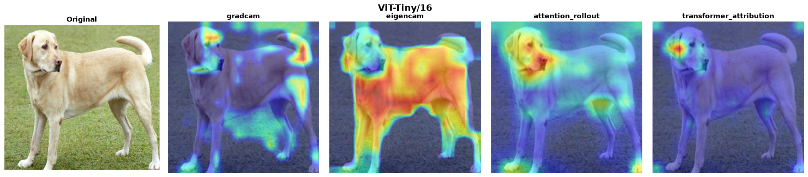

| Method | Status | Time | Notes |
|--------|--------|------|-------|
| GradCAM | ⚠️ | 71ms | Noisy on very small ViTs — prefer the methods below |
| EigenCAM | ✅ | 43ms | Segments the full subject |
| Attention Rollout | ✅ | 42ms | Auto-selected default for ViTs |
| Transformer Attribution | ✅ | 34ms | Class-specific |

```python
model = timm.create_model("vit_tiny_patch16_224", pretrained=True)
heatmap = explain(model, "dog.jpg")  # auto-selects attention rollout
```

---

### 2. DeiT-Tiny/16 (timm)

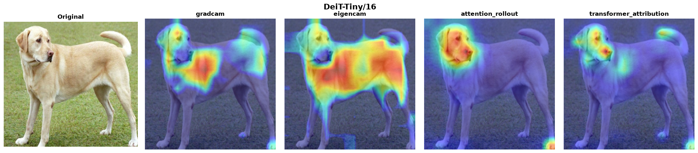

| Method | Status | Time |
|--------|--------|------|
| GradCAM | ✅ | 62ms |
| EigenCAM | ✅ | 49ms |
| Attention Rollout | ✅ | 43ms |
| Transformer Attribution | ✅ | 35ms |

---

### 3. Swin-Tiny (timm)

Shifted-window attention — hierarchical patches, not global. Window
attention cannot be rolled out globally, so gradient/activation CAMs are
the supported methods (rollout falls back to EigenCAM with a warning).

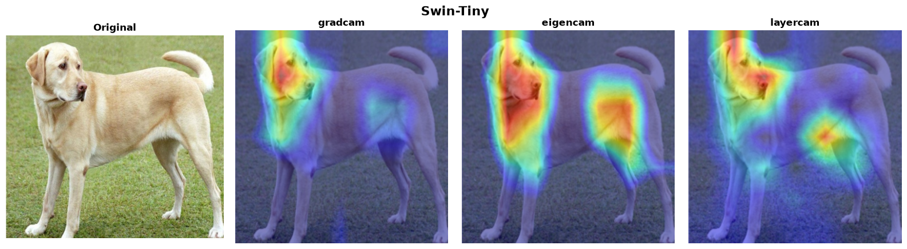

| Method | Status | Time |
|--------|--------|------|
| GradCAM | ✅ | 198ms |
| EigenCAM | ✅ | 159ms |
| LayerCAM | ✅ | 183ms |

---

### 4. EVA-02 Base @ 448 (timm)

torchxai reads the 448×448 input size from the model automatically and
derives the token grid from the actual sequence length, so the 32×32
patch grid needs no manual configuration.

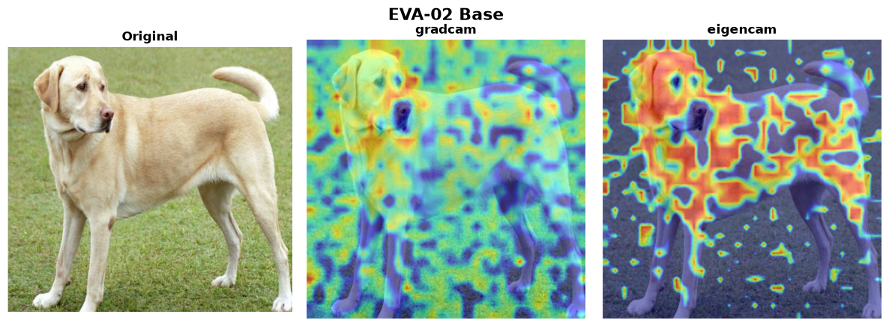

| Method | Status | Time |
|--------|--------|------|
| GradCAM | ✅ | 1,271ms |
| EigenCAM | ✅ | 973ms |

```python
model = timm.create_model("eva02_base_patch14_448.mim_in22k_ft_in22k_in1k", pretrained=True)
heatmap = explain(model, "dog.jpg")  # input size auto-resolved to 448
```

---

### 5. MaxViT-Tiny (timm)

Multi-axis attention hybrid. torchxai hooks the full final block (matching
the pytorch-grad-cam reference), not an internal sub-module.

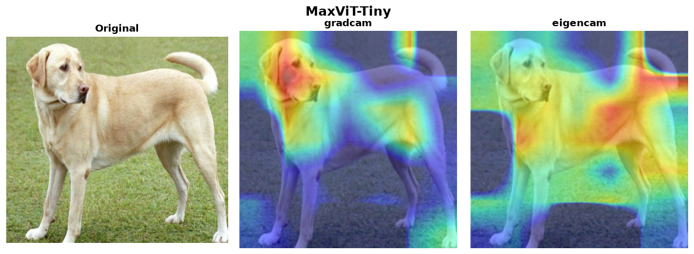

| Method | Status | Time |
|--------|--------|------|
| GradCAM | ✅ | 1,472ms |
| EigenCAM | ✅ | 965ms |
| LayerCAM | ⚠️ | — | borderline localization; use GradCAM |

---

### 6. DINOv2 ViT-S/14

DINOv2 ships without a classification head. Wrap it with a linear layer
for `explain()` compatibility. **EigenCAM is the auto-selected method** —
it segments the subject from the patch features and needs no trained head.

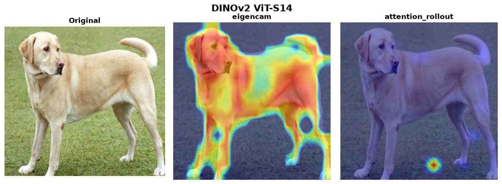

| Method | Status | Time | Notes |
|--------|--------|------|-------|
| EigenCAM | ✅ | 132ms | Auto-selected; works with an untrained head |
| Attention Rollout | ⚠️ | 88ms | Register-less DINOv2 has attention-sink artifacts that hollow out rollout maps |
| GradCAM | ⚠️ | — | Only meaningful with a **trained** classification head |

```python
from torchxai import explain
import torch
import torch.nn as nn

backbone = torch.hub.load("facebookresearch/dinov2", "dinov2_vits14")

class DINOv2Classifier(nn.Module):
    def __init__(self, backbone, num_classes=1000):
        super().__init__()
        self.backbone = backbone
        self.head = nn.Linear(backbone.embed_dim, num_classes)

    def forward(self, x):
        features = self.backbone(x)
        return self.head(features)

model = DINOv2Classifier(backbone)
heatmap = explain(model, "dog.jpg")  # auto-selects EigenCAM
```

---

## Section 3: Object Detection

Detection models are explained with EigenCAM on the backbone/neck features
(gradients through detection heads are unreliable). torchxai auto-detects
Ultralytics models and targets the last feature layer before the Detect head.

### 1–3. YOLO26n / YOLO11n / YOLOv8n (Ultralytics)

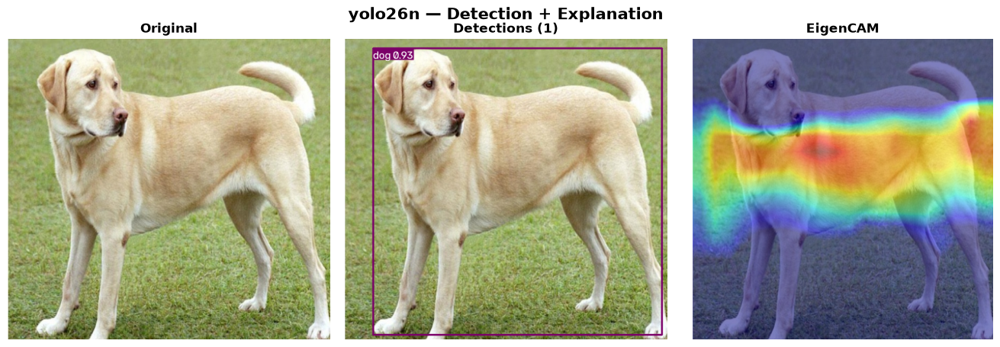
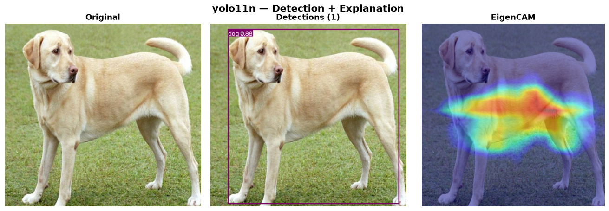
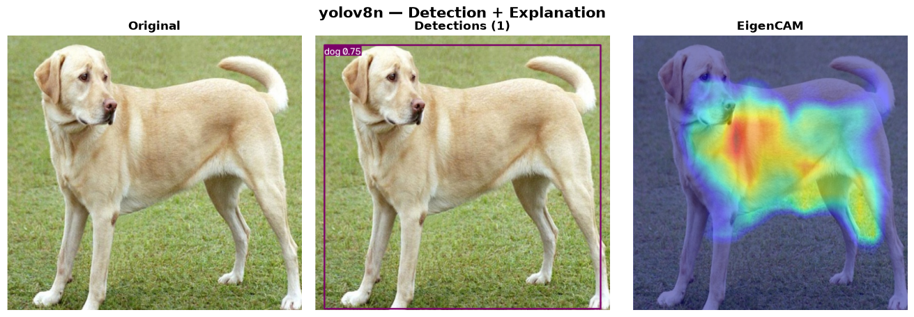

| Model | Detections | EigenCAM |
|-------|-----------|----------|
| YOLO26n | ✅ | ✅ |
| YOLO11n | ✅ | ✅ |
| YOLOv8n | ✅ | ✅ |

```python
from ultralytics import YOLO
from torchxai import explain

yolo = YOLO("yolo26n.pt")
results = yolo("dog.jpg")                     # detections

# EigenCAM heatmap of the backbone features (auto-targeted)
heatmap = explain(yolo.model, "dog.jpg", method="eigencam", image_size=(640, 640))
```

For per-detection explanations (heatmap cropped/masked per bounding box):

```python
from torchxai.detection import explain_detection

explanations = explain_detection(yolo.model, "dog.jpg")
for exp in explanations:
    print(exp.class_id, exp.confidence, exp.heatmap.shape)
```

---

### 4. RF-DETR Base (Roboflow, ICLR 2026)

Detection **and** a real backbone heatmap, verified end-to-end.

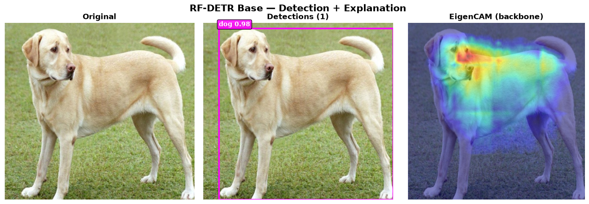

```python
from rfdetr import RFDETRBase
from torchxai import explain

rf = RFDETRBase()
detections = rf.predict("dog.jpg", threshold=0.5)

core = rf.model.model  # LWDETR nn.Module
heatmap = explain(core, "dog.jpg", method="eigencam",
                  target_layer=core.backbone,
                  image_size=(rf.model.resolution, rf.model.resolution))
```

---

## Section 4: Input-Level Methods

SmoothGrad, Integrated Gradients, and RISE operate directly on pixel
gradients rather than intermediate layer activations. They are
architecture-agnostic — every model in this document is compatible.

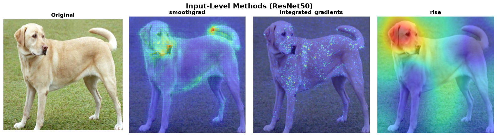

| Method | Status | Time | Notes |
|--------|--------|------|-------|
| SmoothGrad | ✅ | ~4s | Averages gradients over 50 noisy copies |
| Integrated Gradients | ✅ | ~4s | 50-step path integral |
| RISE | ✅ | ~3.5min | 4,000 random mask samples — most thorough |

```python
heatmap = explain(model, "dog.jpg", method="smoothgrad")
heatmap = explain(model, "dog.jpg", method="integrated_gradients")
heatmap = explain(model, "dog.jpg", method="rise")
```

---

## Section 5: Full Compatibility Matrix

| Model | GradCAM | EigenCAM | LayerCAM | GradCAM++ | ScoreCAM | Attn Rollout | Transf. Attr | SmoothGrad | Int. Grads | RISE |
|-------|:-------:|:--------:|:--------:|:---------:|:--------:|:------------:|:------------:|:----------:|:----------:|:----:|
| **ResNet50** | ✅ | ✅ | ✅ | ✅ | ✅ | — | — | ✅ | ✅ | ✅ |
| **VGG16** | ✅ | ✅ | ✅ | ✅ | ✅ | — | — | ✅ | ✅ | ✅ |
| **EfficientNet-B0** | ✅ | ✅ | ✅ | ✅ | ✅ | — | — | ✅ | ✅ | ✅ |
| **EfficientNetV2-S** | ✅ | ✅ | ✅ | ✅ | — | — | — | ✅ | ✅ | ✅ |
| **MobileNetV3-Small** | ✅ | ✅ | ✅ | ✅ | ✅ | — | — | ✅ | ✅ | ✅ |
| **MobileNetV4-Small** | ✅ | ✅ | ✅ | ✅ | — | — | — | ✅ | ✅ | ✅ |
| **ConvNeXt-Tiny** | ✅ | ✅ | ✅ | ✅ | — | — | — | ✅ | ✅ | ✅ |
| **ConvNeXt V2 Tiny** | ✅ | ✅ | ✅ | ✅ | ✅ | — | — | ✅ | ✅ | ✅ |
| **ConvNeXt-Zepto** | ✅ | ✅ | ✅ | ✅ | — | — | — | ✅ | ✅ | ✅ |
| **RegNetY-400MF** | ✅ | ✅ | ✅ | ✅ | — | — | — | ✅ | ✅ | ✅ |
| **RepVGG-B0** | ✅ | ✅ | ✅ | ✅ | — | — | — | ✅ | ✅ | ✅ |
| **GhostNetV3** | ✅ | ✅ | — | — | — | — | — | ✅ | ✅ | ✅ |
| **EfficientNet-H B5** | ✅ | ✅ | — | — | — | — | — | ✅ | ✅ | ✅ |
| **DenseNet121** | ⚠️ | ✅ | ⚠️ | ⚠️ | ✅ | — | — | ✅ | ✅ | ✅ |
| **ViT-Tiny/16** | ⚠️ | ✅ | — | — | — | ✅ | ✅ | ✅ | ✅ | ✅ |
| **DeiT-Tiny/16** | ✅ | ✅ | — | — | — | ✅ | ✅ | ✅ | ✅ | ✅ |
| **Swin-Tiny** | ✅ | ✅ | ✅ | — | — | — | — | ✅ | ✅ | ✅ |
| **EVA-02 Base** | ✅ | ✅ | — | — | — | — | — | ✅ | ✅ | ✅ |
| **MaxViT-Tiny** | ✅ | ✅ | ⚠️ | — | — | — | — | ✅ | ✅ | ✅ |
| **DINOv2 ViT-S/14** | ⚠️ | ✅ | — | — | — | ⚠️ | — | ✅ | ✅ | ✅ |
| **YOLO26n / YOLO11n / YOLOv8n** | — | ✅ | — | — | — | — | — | — | — | — |
| **RF-DETR Base** | — | ✅ | — | — | — | — | — | — | — | — |

**Legend:** ✅ verified against the automated foreground check · ⚠️ known
limitation (see model notes) · — not applicable / not verified for this
architecture

---

## Section 6: How to Reproduce

Every proof image on this page is generated by
[`generate_proof_images.py`](https://github.com/rigvedrs/torchxai/blob/main/generate_proof_images.py) in the project
root, using real pretrained weights and the same Labrador Retriever input
image. The script also writes
[`verification_results.json`](assets/proof/verification_results.json) with a
pass/fail verdict for every model × method combination and **fails loudly**
if any heatmap goes flat, inverts onto the background, or crashes.

**Install dependencies:**

```bash
pip install torchxai-explain
pip install timm            # timm model families
pip install ultralytics     # YOLO26n, YOLO11n, YOLOv8n (optional)
pip install rfdetr          # RF-DETR Base (optional)
```

**Run the full proof suite:**

```bash
python generate_proof_images.py            # everything (~30 min on CPU)
python generate_proof_images.py --skip-slow    # skip ScoreCAM + RISE
python generate_proof_images.py --only resnet50,vit_tiny_16
python generate_proof_images.py --strict   # non-zero exit if any check fails
```

Output images are saved to `docs/assets/proof/`. The master grid is
regenerated automatically at `docs/assets/proof/master_grid_final.png`.
